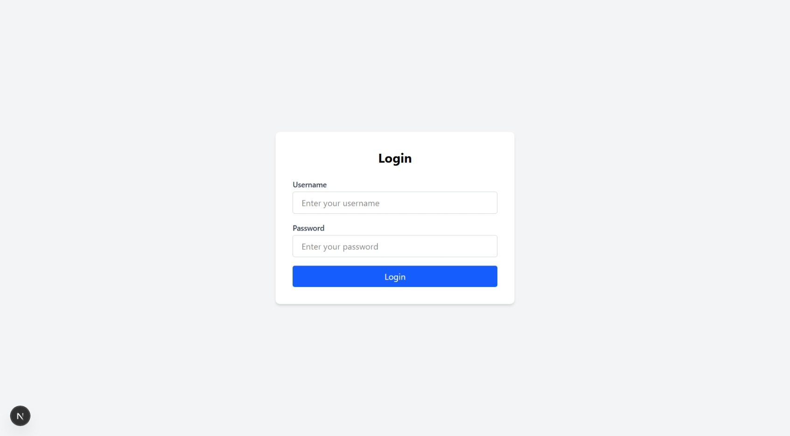
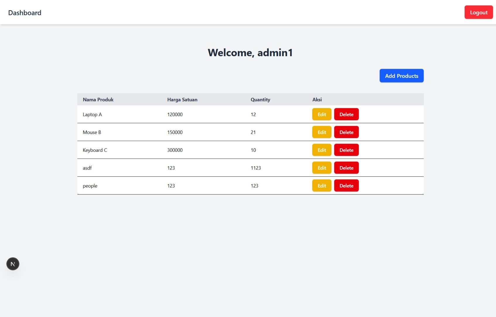
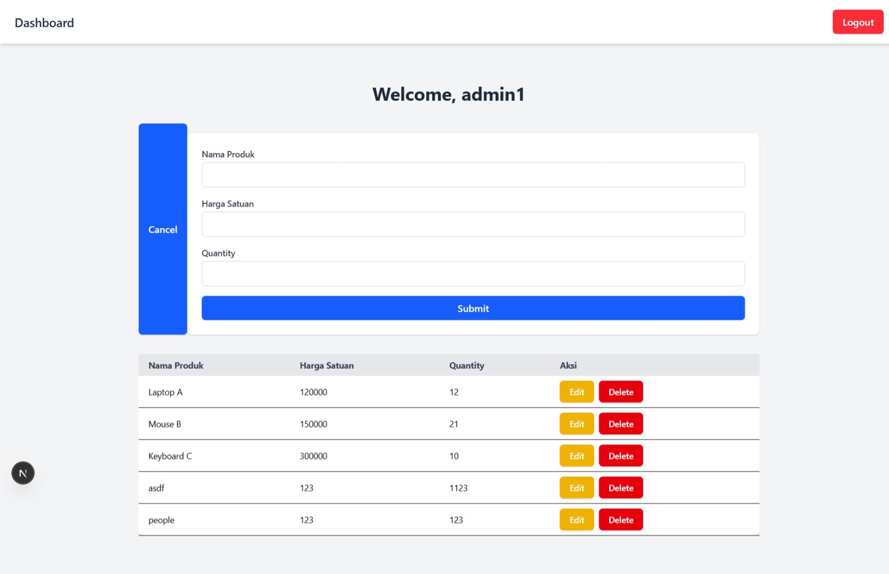
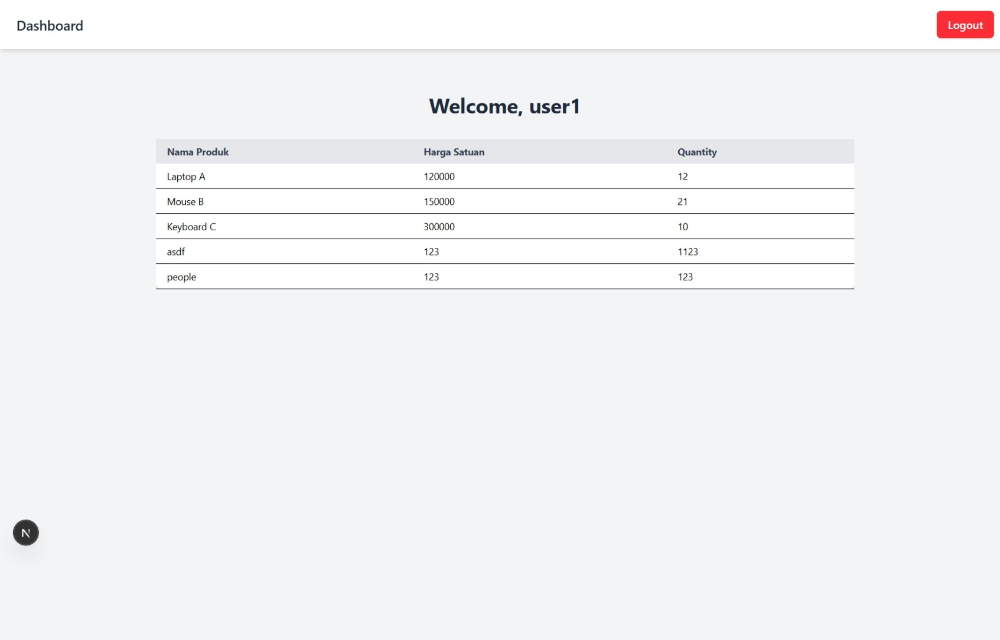

# UAS Client Side Programming C14210041

## Application needed to run this code:
1. Visual Studio Code

## Steps to run
1. npm install
2. npm install -g json-server
3. edit .env.local.example into .env.local
4. edit the JWT_SECRET inside .env.local
5. open a bash terminal in visual studio
6. json-server -w db.json -p 5000
7. open a powershell terminal in visual studio
8. npm run dev
9. open http://localhost:3000 in browser

## Accounts to test with
1. role=admin => username=admin1, password=adminpassword
2. role=user => username=user1, password=password123

## UI

